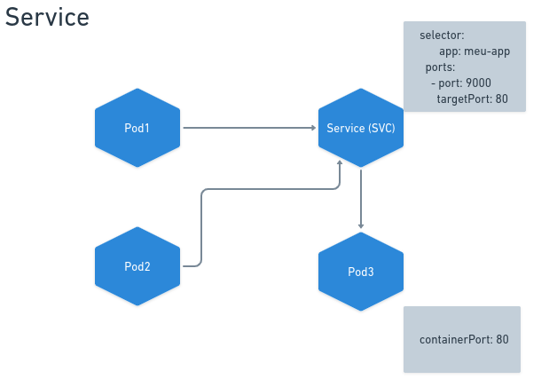

<h1 align="center">
  
  <br>
  Kubernetes - Gerenciando um Server em Go
</h1>

<div align="center">

[]()
[]()

</div>

# Kubernetes

O Kubernetes é uma plataforma de código aberto para automatizar a implantação, escalonamento e operação de aplicativos em contêineres. Ele utiliza uma arquitetura mestre/nó para gerenciar e orquestrar os contêineres de maneira eficiente.

## Mestre (Master)
O componente mestre é o cérebro do cluster Kubernetes, responsável por gerenciar e manter o estado desejado do sistema. Ele consiste em:
- **API Server:** Uma interface REST que recebe e executa comandos para interagir com o cluster. Os administradores e usuários utilizam essa API para controlar o ambiente.
- **Controller Manager:** Responsável por garantir que o estado atual do sistema corresponda ao estado desejado. Isso inclui o Controller Manager que gerencia objetos como ReplicaSets e Deployments.
- **Scheduler:** Encarregado de decidir onde os pods (a menor unidade em Kubernetes) serão executados no cluster, levando em consideração os recursos disponíveis e as políticas definidas.
- **ETCD:** Um banco de dados chave-valor altamente disponível que armazena todos os dados vitais do cluster. Ele serve como o cérebro persistente do Kubernetes, mantendo o estado do sistema mesmo após falhas.

## Nó (Node)
Os nós são as máquinas físicas ou virtuais que compõem o cluster. Eles executam as aplicações empacotadas em contêineres. Cada nó possui:
- **Kubelet:** Agente que executa na máquina e garante que os containers estejam em execução nos pods.
- **KubeProxy:** Facilita a comunicação entre os pods e gerencia as regras de rede. É responsável por garantir que os pods possam se comunicar entre si, mesmo que estejam em diferentes nós.

## API
O Kubernetes fornece uma variedade de objetos que podem ser gerenciados por meio da API. Alguns desses objetos incluem:
- **Pod:** A menor unidade em Kubernetes, representando um único processo em execução em algum lugar no cluster.
- **ReplicaSet:** Mantém um conjunto especificado de réplicas de pods em execução para garantir a disponibilidade e escalabilidade.
- **Deployment:** Define como os pods são implantados e atualizados. Facilita a atualização e rotação de novas versões de aplicações.
- **Volume:** Um diretório acessível a containers em um pod. Pode ser usado para armazenamento durável ou para compartilhamento de dados entre pods.


# Iniciando o cluster Kubernetes 
Arquivo kind com o código para a criação do cluster.<br>
`kind.yaml`
```
kind: Cluster
apiVersion: kind.x-k8s.io/v1alpha4

nodes:
- role: control-plane
```
Comando para criar o kluster:
```
kind create cluster --config=k8s/kind.yaml --name=meu-cluster
```

Verificar o status do cluster
```
kind cluster-info --context kind-meu-cluster
```

# Criando um Pod
`pod.yaml`
```
apiVersion: v1
kind: Pod
metadata:
  name: pod-nginx
spec:
  containers:
    - name: container-nginx
      image: nginx:latest
```
Aplicando
```
kubectl apply -f k8s/pod.yaml
```

# Trabalhando com Service (SVC)

<h1 align="center">
  
  <br>
</h1>

## ClusterIP
Mecanimos de comunicação interna dos pods utilizando o `type: ClusterIP` com o `type: ClusterIP`. 
* Abstração para expor aplicaçãoes executando em um ou mais pods.
* Provem IP's fixos para comunicação.
* Provem um DNS para um ou mais pods.
* São capazes de fazer balanceamento de carga.
* Usa labels para identificação que pode ser qualquer nome e valor.
* Ouve em uma parta e envia em outra porta.

`pod-2.yaml`
 * `app: segundo-pod` label do service para comunicação.
 * `containerPort: 80` porta que ouve a comunicação.
```
apiVersion: v1 
kind: Pod 
metadata: 
  name: pod-2
  labels:
    app: segundo-pod # svc-pode2.yaml utiliza para saber com quem ele deve se comunicar
spec: 
  containers:
    - name: container-pod-2
      image: nginx:latest
      ports: 
        - containerPort: 80
```

`svc-pode-2.yaml`
* `selector` local onde informa o label para comunicação.
* `port: 9000` porta que ouve.
* `targetPort: 80` porta que envia.

```
apiVersion: v1 
kind: Service
metadata:
  name: svc-pod-2
spec:
  type: ClusterIP
  selector:
    app: segundo-pod
  ports:
    - port: 9000 
      targetPort: 80 
```
## NodeIP
* Service que permite a comunicação com o mundo externo. 
* Funciona como ClusterIP. 
* Dentro do cluster permite que as máquinas se comuniquem.


`pod-1.yaml`
* `app: primeiro-pod` label de identificação.
* `containerPort: 80` porta de comunicação.
```
apiVersion: v1 
kind: Pod 
metadata: 
  name: pod-1
  labels: 
    app: primeiro-pod
spec: 
  containers:
    - name: container-pod-1
      image: nginx:latest
      ports: 
        - containerPort: 80
```
`svc-pod-1.yaml`
* `port: 80` porta roda o serviço.
* `nodePort: 3000` porta para acesso externo.
* `app: primeiro-pod` label de identificação.
```
apiVersion: v1
kind: Service
metadata:
  name: svc-pod-1
spec:
  type: NodePort
  ports:
    - port: 80
      nodePort: 30000
  selector:
    app: primeiro-pod
```
Aplicando a alteração.
```
kubectl apply -f k8s/pod-1.yaml
kubectl apply -f k8s/svc-pod-1.yaml
```
Buscando o caminho para acessar o serviço.
```
kubectl get svc -o wide
```
No `PORT(S)` vai mostrar que o serviço está sendo executado na porta 80 mapeando para porta 30000.
```
kubectl get nodes -o wide
```
No `INTERNAL-IP` vai mostrar o IP para acessar a aplicação.
* **Linux**: Pegar o INTERNAL-IP:30000
* **Windows**: http://localhost:30000

## Load Balancer
Serviço para aplicações na nuvem. Abre a comunicação para o mundo externo usando o load balancer do provedor.<br>
`svc-load-balancer.yaml`
* `port: 80` porta roda o serviço.
* `nodePort: 3000` porta para acesso externo.
```
apiVersion: v1
kind: Service
metadata:
  name: svc-pod-1-loadbalancer
spec:
  type: LoadBalancer
  ports:
  - port: 80
    nodePort: 30000
  selector:
    app: primeiro-pod
```

# Comandos

| **Comandos** | **Descrição** |
|----------|---------------|
| kubectl api-resources | Mostra  os recursos |
| kubectl apply -f < nome > | Para aplicar o arquivo |
| kubectl delete pod < nome > | Delete o pod |
| kubectl describe pod < nome > | Mostra as informaçoes |
| kubectl exec -it < nome do pod > -- bash | Entra no modo interativo |
| kubectl get po | Mostra os pods ativos |
| kubectl get pods --watch | Acompanhar os pods |
| kubectl get pods -o wide | Mostra mais informação dos pods |
| kubectl get po -o wide | Mostra mais informações dos pods |
| kubectl get svc -o wide | Mostra mais informação dos services |

# Comando de Configurações
| **Comandos** | **Descrição** |
|----------|---------------|
| cat ~/.kube/config | Mostra as configurações |
| kubectl config view| Mostra as configurações do cluster do name space default |
