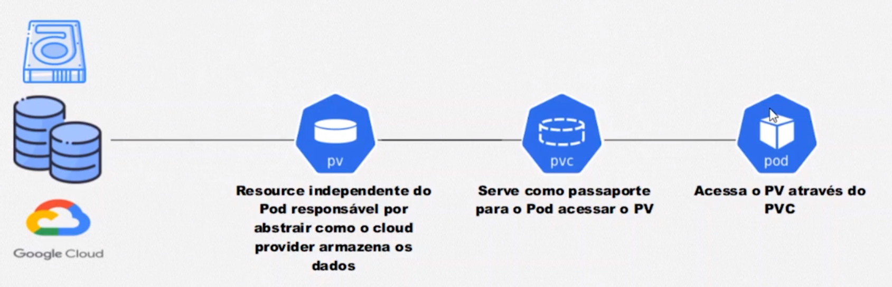

<h1 align="center">
  
  <br>
  Kubernetes - Parte 2
</h1>

<div align="center">

[]()
[]()

</div>

# ReplicaSet
O ReplicaSet monitora continuamente o estado dos Pods que está gerenciando. Se, por algum motivo, o número de Pods cair abaixo do desejado, o ReplicaSet inicia automaticamente a criação de novas cópias, restaurando assim o número correto de instâncias. Essa capacidade de autorrecuperação contribui significativamente para a resiliência da aplicação, garantindo que ela permaneça disponível mesmo em face de falhas inesperadas.


`portal-noticias-replicaset.yaml`
```
apiVersion: apps/v1
kind: Replicaset 
metadata:
  name: portal-noticias-replicaset
spec:
  template:
    metadata:
      name: portal-noticias
      labels: 
        app: portal-noticias
    spec:
      containers:
        - name: portal-noticias-container
          image: aluracursos/portal-noticias:1
          ports:
            - containerPort: 8080
          envFrom:
            - configMapRef:
                name: portal-configmap
  replicas: 3
  selector:
    matchLabels:
      app: portal-noticias
```

# Deployment
Um Deployment no Kubernetes simplifica o processo de implantação e atualização de aplicações, fornecendo uma abordagem declarativa. Ele especifica o estado desejado da aplicação e deixa o Kubernetes encarregar-se da implementação.

Ao atualizar a versão da aplicação em um Deployment, o Kubernetes realiza a transição de maneira controlada, garantindo que a nova versão seja gradualmente implantada, e verifica constantemente a integridade da aplicação. Se algo der errado, o Deployment permite a reversão rápida para a versão anterior, assegurando a continuidade do serviço.

Outro ponto-chave é a facilidade de escalabilidade. Com um simples ajuste na configuração do Deployment, é possível aumentar ou diminuir o número de réplicas da aplicação conforme a demanda.

`portal-noticias-deployment.yaml`
```
apiVersion: apps/v1
kind: Deployment 
metadata:
  name: portal-noticias-deployment
spec:
  template:
    metadata:
      name: portal-noticias
      labels: 
        app: portal-noticias
    spec:
      containers:
        - name: portal-noticias-container
          image: aluracursos/portal-noticias:1
          ports:
            - containerPort: 8080
          envFrom:
            - configMapRef:
                name: portal-configmap
  replicas: 3
  selector:
    matchLabels:
      app: portal-noticias
```

# Persistência de Dados
A persistência de dados refere-se à capacidade de manter a integridade e a disponibilidade dos dados além da execução temporária de um programa ou processo. Em sistemas de computação, a persistência de dados é fundamental para garantir que as informações não se percam quando um programa é encerrado, um sistema é reiniciado ou um dispositivo é desligado.

## Volumes
Os Volumes no Kubernetes são meios eficazes para lidar com o armazenamento de dados associados a contêineres em Pods. Eles possuem um ciclo de vida que está diretamente ligado ao ciclo de vida do Pod em que estão inseridos. Vale destacar que, mesmo em caso de falha do Pod, os dados armazenados no Volume permanecem preservados. Contudo, é importante notar que a associação específica entre o Pod e o Volume é perdida em caso de falha.

`db-volume.yaml`
```
apiVersion: v1 
kind: Pod 
metadata:
  name: pod-volume
spec: 
  containers:
    - name: nginx-container
      image: nginx:latest
      volumeMounts:
        - mountPath: /dados-persistidos
          name: meu-volume
    - name: jenkins-container
      image: jenkins/jenkins:alpine
      volumeMounts:
        - mountPath: /dados-persistidos
          name: meu-volume
  volumes:
    - name: meu-volume
      hostPath:
        path: /home/rafael/Documentos/github/kubernetes/02.02-refatorando
        type: DirectoryOrCreate
```
* Caso não tenha a pasta no diretório o kubernetes irá criar.

## Persistents Volumes
<h1 align="center">
  
</h1>

Solução robusta para o armazenamento de dados no Kubernetes. Eles têm ciclos de vida independentes dos Pods, o que significa que persistem mesmo quando os Pods são reiniciados ou removidos. Para acessar um Volume Persistente, é necessário criar um PersistentVolumeClaim, que atua como uma solicitação para obter acesso a uma porção específica do Volume Persistente.<br>
Tipos:
* ReadWriteOnce: Somente um pod pode lêr e escrever.
* ReadWriteMany: Vários pods podem lêr e escrever.
* ReadOnlyMany: Vários pods podem apenas lêr.

`persistent-volume.yaml`
* **pdName**: Nome dos disco criado na nuvem
```
apiVersion: v1
kind: PersistentVolume
metadata:
  name: persistent-volume
spec:
  capacity:
    storage: 10Gi
  accessModes:
    - ReadWriteOnce
  gcePersistenDisk:
    pdName: meu-disco
  storageClassName: standard
```

## Persistent Volume Claim
Atua como uma espécie de pedido formal por uma quantidade específica de armazenamento em um PersistentVolume. Quando um PersistentVolumeClaim é criado, o Kubernetes tenta vinculá-lo a um PersistentVolume disponível que atenda aos requisitos da solicitação. Isso proporciona uma camada adicional de abstração, permitindo que os desenvolvedores solicitem e acessem armazenamento persistente de maneira simplificada e eficiente.
* Para eles se enxergarem precisa ter o mesmo modo de acesso e a mesma capacidade. Com isso ele faz o Bound.
* É necessário um PersistentVolumeClaim para acessar um PersistentVolume.<br>
`persistent-volume-claim.yaml`
```
apiVersion: v1
kind: PersistentVolumeClaim
metadata:
  name: persistent-volume-clain
spec:
  accessModes:
    - ReadWriteOnce
  resources:
    requests:
      storage: 10Gi
  storageClassName: standard
```
Criação do pod que vai acessar o disco através do Persistent Volume.<br>
`persistent-pod.yaml`
```
apiVersion: v1 
kind: Pod 
metadata: 
  name: pod-pv
spec:
  containers:
    - name: nginx-containers
      image: nginx:latest
      volumeMounts:
        - mountPath: /volume-dentro-do-container
          name: primeiro-pv
  volumes:
    - name: primeiro-pv
      persistentVolumeClaim:
        claimName: persistent-volume-clain
```
* **claimName**: Nome do volume do Persistent clain que é usado para identificação.

## Storage Classes
<h1 align="center">
  
</h1>
Fornecem uma maneira flexível (sob demanda) de definir as propriedades do armazenamento no Kubernetes. Elas permitem que os administradores de cluster forneçam perfis de armazenamento predefinidos para os desenvolvedores, simplificando a configuração e o provisionamento de armazenamento. Ao utilizar Storage Classes, é possível definir características como tipo de armazenamento, provisionamento dinâmico e políticas de reciclagem, proporcionando maior controle e eficiência na gestão do armazenamento.<br>
`storage-class.yaml`
```
apiVersion: storage.k8s.io/v1
kind: StorageClass
metadata:
  name: slow
provisioner: kubernetes.io/gce-pd # Google
parameters:
  type: pd-standard
  fstype: extr4
  replication-type: none
```
* **provisioner**: Para cada provedor de nuvem tem o seu tipo.

Criação dos Persistent Volume Claim<br>
`storage-class-pvc.yaml`
```
apiVersion: v1 
kind: PersistentVolumeClaim 
metadata:
  name: storage-class-persistent
spec:
  accessModes:
    - ReadWriteOnce
  resources: 
    requests:
      storage: 10Gi
  storageClassName: slow
```
Pod para consumir os dados.<br>
`storage-pod.yaml`
```
apiVersion: v1 
kind: Pod 
metadata:
  name: pod-storage-class
spec: 
  containers:
    - name: nginx-container
      image: nginx:latest
      volumeMounts:
        - mountPath: /volume-dentroo-do-container
          name: meu-pvc
  volumes: 
    - name: meu-pvc
      persistentVolumeClaim:
        claimName: storage-class-persistent
```

> [!WARNING] 
> Da mesma forma que o disco é criado dinamicamente quando o storage clas é apagado o disco tambem é apagado.

# Stateful Set
StatefulSets são uma escolha robusta quando a persistência de estados é essencial em ambientes Kubernetes. Esses conjuntos oferecem suporte à persistência de dados por meio da integração inteligente com PersistentVolumes e PersistentVolumeClaims.

No ecossistema padrão do cluster, uma Storage Class está prontamente disponível. Esse componente é fundamental, pois estabelece a conexão necessária entre as reivindicações de volumes persistentes (Persistent Volume Claims) e os volumes persistentes propriamente ditos. Isso simplifica significativamente o processo, garantindo que cada reivindicação de volume persistente esteja adequadamente vinculada a um volume persistente existente.

Uma característica notável é que, ao criar uma reivindicação de volume persistente sem explicitamente especificar qual volume deve ser utilizado, o Kubernetes automaticamente recorre à Storage Class para criar dinamicamente o Persistent Volume desejado. Essa abordagem dinâmica simplifica a administração, permitindo que o sistema cuide automaticamente da alocação de volumes, proporcionando flexibilidade e eficiência na gestão de armazenamento.

`statefulset-pvc-imagem.yaml`
```
apiVersion: v1 
kind: PersistentVoumeClaim 
metadata:
  name: pvc-imagem
spec:
  accessModes:
    - ReadWriteOnce
  resources:
    requests:
      storage: 1Gi
```
`statefulset-pvc-sessao.yaml`
```
apiVersion: v1 
kind: PersistentVoumeClaim 
metadata:
  name: pvc-sessao
spec:
  accessModes:
    - ReadWriteOnce
  resources:
    requests:
      storage: 1Gi
```
`statefulset-noticias.yaml`
```
apiVersion: apps/v1
kind: StatefulSet
metadata:
  name: statefulset-portal-noticias
spec:
  selector:
    matchLabels:
      app: portal-noticias
  serviceName: svc-sistema-noticias
  replicas: 1
  template:
    metadata:
      labels:
        app: portal-noticias
      name: portal-noticias
    spec:
      containers:
        - name: portal-noticias-container
          image: aluracursos/portal-noticias:1
          ports:
            - containerPort: 8080
          envFrom:
            - configMapRef:
                name: portal-configmap
          volumeMounts:
            - name: imagens 
              mountPath: /var/www/html/uploads
            - name: sessao
              mountPath: /tmp
      volumes: 
        - name: imagens
          persistentVolumeClaim:
            claimName: pvc-imagem
        - name: sessao
          persistentVolumeClaim:
            claimName: pvc-sessao
```


# Probes
## Liveness Probe
Liveness Probes desempenham um papel fundamental ao informar ao sistema quando uma aplicação não está comportando-se conforme o esperado. Estas sondas de "liveness" servem como mecanismos de monitoramento ativo, verificando continuamente se a aplicação está em um estado operacional saudável.

Quando uma Liveness Probe detecta que a aplicação não está se comportando corretamente, ela comunica isso ao Kubernetes. A partir dessa informação, o Kubernetes pode automaticamente reagir, realizando ações como reiniciar a aplicação ou redirecionando o tráfego para instâncias saudáveis.

Essas sondas de liveness oferecem uma camada adicional de robustez e automação ao ambiente Kubernetes, garantindo que as aplicações sejam mantidas em um estado de execução confiável. Em resumo, as Liveness Probes não apenas identificam falhas, mas também permitem que o Kubernetes tome medidas proativas para manter a integridade e o desempenho contínuo das aplicações em execução.

* Verifica a cada 10 segundos.
* Testa 3 vezes.
* Aguarda 20 segundos antes de começar a verificar.<br>
`statefulset-noticias.yaml`
```
apiVersion: apps/v1
kind: StatefulSet
...
      containers:
      ...
          livenessProbe:
            httpGet:
              path: /
              port: 8080
            periodSeconds: 10
            failureThreshold: 3
            initialDelaySeconds: 20
    ...
```

## Readiness Probe
Readiness Probes, desempenham um papel crucial para garantir que uma aplicação esteja pronta e capaz de receber tráfego de maneira eficiente. Essas sondas de "readiness" são ferramentas de verificação que informam ao Kubernetes se a aplicação está apta a processar solicitações de forma adequada.

Ao contrário das Liveness Probes, cujo objetivo é identificar se a aplicação está em um estado operacional saudável, as Readiness Probes focam em determinar se a aplicação está pronta para receber tráfego externo. Essa distinção é crucial, pois permite que o Kubernetes direcione o tráfego apenas para instâncias que estão totalmente prontas para atender às solicitações, evitando que tráfego prejudicial alcance instâncias que ainda estão em processo de inicialização ou recuperação.

Quando uma Readiness Probe indica que uma aplicação está pronta para receber tráfego, o Kubernetes ajusta dinamicamente os balanceadores de carga, direcionando solicitações para essas instâncias específicas. Isso assegura que os usuários obtenham uma experiência contínua, apenas interagindo com instâncias que estão totalmente prontas para processar suas requisições.

Em resumo, as Readiness Probes são essenciais para otimizar a distribuição de tráfego, garantindo que apenas instâncias preparadas e operacionais estejam ativas no pool de servidores, proporcionando uma experiência consistente e resiliente para os usuários.

`statefulset-noticias.yaml`
```
apiVersion: apps/v1
kind: StatefulSet
...
      containers:
      ...
          readinessProbe:
            httpGet:
              path: /
              port: 8080
            periodSeconds: 10
            failureThreshold: 5
            initialDelaySeconds: 3
    ...
```

* Outra forma de fazer verificações é através de portas.

# Horizonte Pot Autoscaler - HPA 
* [Documentação](https://github.com/kubernetes-sigs/metrics-server#requirements)
* [Baixar a última versão do HPA](https://github.com/kubernetes-sigs/metrics-server/releases)

`hpa-noticias.yaml`
```
apiVersion: autoscaling/v2beta2
kind: HorizontalPodAutoscaler 
metadata:
  name: hpa-portal-noticias
spec:
  minReplicas: 1
  maxReplicas: 10
  
  scaleTargetRef:
    apiVersion: apps/v1
    kind: StatefulSet 
    name: statefulset-portal-noticias
  
  metrics:
    - type: Resource 
      resource:
        name: cpu 
        target: 
          type: Utilization
          averageUtilization: 50 # %
```
# Comandos

| **Comandos** | **Descrição** |
|----------|---------------|
| kubectl annotate deployment < nome do deployment > kubernetes.io/change-cause="Minha anotaçao" | Cria uma anotação no revision do **rollout**|
| kubectl delete pod --all | Deleta todos os pod |
| kubectl delete pvc --all | Deleta todos os persistent volume claim |
| kubectl delete sc --all | Deleta todos os storage class |
| kubectl get replicasets | Mostra  os replicasets |
| kubectl rollout history deployment < nome do deployment > | Mostra a versão do deployment |
| kubectl rollout undo deployment < nome do deployment > --to-revision=2 | Vouta para a versão 2 |