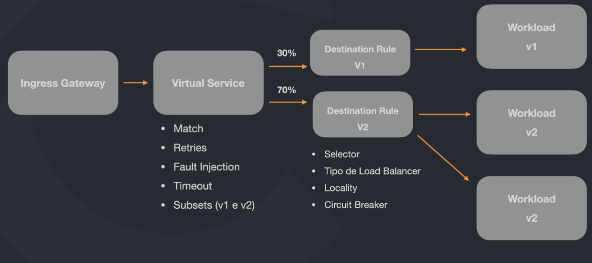

<h1 align="center">
  
  <br>
  Kubernetes - Istio
</h1>

<div align="center">

[]()
[]()

</div>

# Istio - Plataforma de Serviço de Malha para Kubernetes

O Istio é uma plataforma de serviço de malha open-source projetada para simplificar o gerenciamento de comunicações entre os serviços em ambientes distribuídos, especialmente em arquiteturas baseadas em microserviços. Quando integrado com Kubernetes, o Istio oferece uma variedade de funcionalidades essenciais.

## Funcionalidades Principais

* **Gerenciamento de Tráfego:** Controle flexível sobre o roteamento, distribuição de carga e implantação gradual.

* **Observabilidade:** Monitoramento avançado, rastreamento e logging para facilitar a detecção e resolução de problemas.

* **Segurança:** Adição de uma camada de segurança à comunicação entre serviços, incluindo autenticação mútua e criptografia de ponta a ponta.

* **Controle de Acesso e Políticas de Rede:** Definição de políticas de rede e controle de acesso para regular as comunicações entre os serviços.

* **Injeção de Sidecar:** Uso do padrão de sidecar para gerenciar comunicações entre serviços, com um proxy injetado automaticamente em cada contêiner.

* **Resiliência:** Recursos para tornar sistemas mais resilientes, incluindo circuit breaking e retries automáticos.

* **Monitoramento e Relatórios:** Facilita o monitoramento contínuo e a geração de relatórios sobre o tráfego e desempenho dos serviços.

## Integração 

- Prometheus
- Grafana
- Jaeger


# Conceitos Básicos
<div align="center">
  
</div>

* Ingress Gateway: Gerencia a entrada e a saída. Trabalha nos layes 4-6, garantindo o gerenciadomento de portas, host, e TLS. É concectado diretamente a um Virtual Service que será responsável pelo roteamento. Faz as requisiçôes de fora do cluster.
* Virtual Service: Permite configurar como as requisições serão roteadas para um serviço. Possoui uma série de regras que quando aplicadas farão com que a requisição seja direcioanda ao destino correto. Funciona como um roteador.
  * Roteamento do tráfego
  * Subsets
  * Fault Injection
  * Retries
  * Timeout
* Destination Rules: Roteia o trágefo para um destino, então, usa as destination rules para configurar o que acontece com o tráfego quando chaga naquele destino.

# Iniciando o cluster
Cria o master e 2 nodes.
```
k3d cluster create -p "8000:30000@loadbalancer" --agents 2
# trocando de contexto
kubectl config use-context k3d-k3s-default
```
Verificando os nodes:
```
kubectl get nodes
```
Para ver se o serviço está rodando:
```
kubectl get po -n istio-system
```

# Instalando o Istio no Ubuntu
```
curl -L https://istio.io/downloadIstio | sh -
```
Mover para a pasta  `/opt` e configurar as variáveis de ambiente:
```
sudo mv istio-1.20.1/ /opt/ && sudo nano ~/.bashrc
```
Colar:
```
export PATH=$PATH:/opt/istio-1.20.1/bin
```

# Instalando o Istio no Cluster
```
istioctl install -y
```
Se vericar os pods vai perceber que não tem nenhum rodando.
```
kubectl get po
```
Se olhar o namespace vai ver o `istio-system`.
```
kubectl get ns
```
Olhando o istio:
```
kubectl get po -n istio-system
```
Verificando o serviço:
```
kubectl get svc
```
Verificando o serviço do istio:
```
kubectl get svc -n istio-system
```

# Instalando o Sidecar Proxy
Por padrão utiliza 1 container por pod. Neste caso temos 2 containers por pods. O Segundo container genrencia todo o tráfego que passa pelo proxy, onde as regras do Istio serão aplicadas.
```
kubectl label namespace default istio-injection=enabled
```
`deployment.yaml`
```
apiVersion: apps/v1
kind: Deployment
metadata:
  name: nginx
spec:
  selector:
    matchLabels:
      app: nginx
  template:
    metadata:
      labels:
        app: nginx
    spec:
      containers:
      - name: nginx
        image: nginx
        resources:
          limits:
            memory: "128Mi"
            cpu: "500m"
        ports:
        - containerPort: 80
```
Executando o comando `kubectl get po` vai verificar quem 2 pods rodando no mesmo container.

# Observabilidade
Instalando Jaeger:

```
kubectl apply -f https://raw.githubusercontent.com/istio/istio/release-1.20/samples/addons/jaeger.yaml
```

Instalando Kiali:
```
kubectl apply -f https://raw.githubusercontent.com/istio/istio/release-1.20/samples/addons/kiali.yaml
```
Instalando Promethues:
```
kubectl apply -f https://raw.githubusercontent.com/istio/istio/release-1.20/samples/addons/prometheus.yaml
```
Instalando Grafana:
```
kubectl apply -f https://raw.githubusercontent.com/istio/istio/release-1.20/samples/addons/grafana.yaml
```
Abrindo o dashboard:
```
istioctl dashboard kiali
```

# Solicitação
Comando para fazer acesso no serviço em quanto a condição for verdadeira:
```
while true; do curl http://localhost:8000; echo; sleep 0.5; done;
```

# Virtual Service e Destination Rule
O `virtual-service.yaml` recebe a requisição e envia de acordo com as configurações onde o `destination-rule.yml` vai encaminhar para os pods.

`virtual-service.yaml`
```
apiVersion: networking.istio.io/v1alpha3
kind: VirtualService
metadata: 
  name: nginx-vs 
spec:
  hosts:
  - nginx-service
  http:
    - route:
      - destination:
          host: nginx-service
          subset: v1
        weight: 90
      
      - destination:
          host: nginx-service
          subset: v2
        weight: 10
```

`destination-rule.yaml`
```
apiVersion: networking.istio.io/v1alpha3
kind: DestinationRule
metadata: 
  name: nginx-dr
spec:
  host: nginx-service
  subsets:
    - name: v1 
      labels:
        version: A 
    - name: v2
      labels:
        version: B
```

# Solicitação v2 
Executa acessos por 200 segundos.<br>
Baixando:
```
kubectl apply -f https://raw.githubusercontent.com/istio/istio/release-1.20/samples/httpbin/sample-client/fortio-deploy.yaml
```
Variável de ambiente que pega o pod fortio:
```
export FORTIO_POD=$(kubectl get pods -l app=fortio -o 'jsonpath={.items[0].metadata.name}')
```
Executando0 o teste utilizando a variável de ambiente:
```
kubectl exec "$FORTIO_POD" -c fortio -- fortio load -c 2 -qps 0 -t 200s -loglevel Warning http://nginx-service:8000
```

# Tipos de Load Balancer
Quando se tem várias réplicas é possível escolher o tipo de load balancer. Como neste exemplo temos versões diferentes, podemos escolher quantas réplicas quisermos, podemos também, escolher o tipo de load balancer para cada versão do serviço.<br>
Por padrão é o `Round Robin` que tenta manter a quantidade de solicitações de forma mais igualitária.

`destination-rule.yaml`
```
apiVersion: networking.istio.io/v1alpha3
kind: DestinationRule
metadata:
  name: nginx-dr
spec:
  host: nginx-service
  trafficPolicy:
    loadBalancer:
      simple: ROUND_ROBIN

  subsets:
    - name: v1
      labels:
        version: A
      trafficPolicy:
        loadBalancer:
          simple: LEAST_CONN

    - name: v2
      labels:
        version: B
```
* **Round Robin**: Distribui as solicitações de maneira uniforme entre os pods disponíveis. Cada nova solicitação é encaminhada para o próximo pod na lista. É uma abordagem simples e eficaz para equilibrar a carga, garantindo que todos os pods tenham a oportunidade de processar solicitações.
* **Least Connections**: Direciona as solicitações para o pod que tem o menor número atual de conexões ativas. Ele tenta distribuir a carga de maneira proporcional à capacidade de processamento de cada pod. Útil quando os pods têm capacidades de processamento variáveis e desejamos otimizar a distribuição de carga com base na carga real.
* **IP Hash**: utiliza o endereço IP do cliente para determinar a qual pod enviar a solicitação. Isso garante que as solicitações do mesmo cliente sejam sempre enviadas para o mesmo pod. Útil em cenários onde a persistência de sessão é importante e as sessões precisam ser tratadas pelo mesmo pod para manter o estado.
* **Random**: Este método escolhe aleatoriamente um pod disponível para encaminhar a solicitação. Pode ser útil em alguns casos, mas pode não ser a melhor escolha se a uniformidade na distribuição de carga for uma prioridade.
* **Weighted Round Robin e Weighted Least Connections**: Estas variações atribuem pesos diferentes aos pods, influenciando a probabilidade de serem selecionados. Pods com pesos mais altos têm maior probabilidade de serem escolhidos. Permite ajustar a distribuição de carga com base nas capacidades de processamento dos pods.

# Stick Session
Consistent Hash.<br>
Persistência dos dados.<br>
Refere a persistência da sessão, garante que cada requisição do usuário sempre seja enviada para o mesmo pod.
**Não funciona trabalhando com weight**
* httpHeaderName
* httpCookie
* UseSourcelp
* httpQueryParameterName

`consistent-hash.yaml`

Testando a aplicação:
```
kubectl exec -it < nome da imagem>  -- bash
```
Dentro da imagem:
```
curl --header "x-user: rafael"   http://nginx-service:8000
```
Vai ter que cair sempre na mesma imagem seja a **A** ou a **B**.

# Fault Injection 
Injeção de falha para simular problemas. Neste exemplo vai ser criado um delay de 1 segundo para 20% do tráfego.<br>
`fault-injection.yaml`
```
apiVersion: networking.istio.io/v1alpha3
kind: VirtualService
metadata: 
  name: nginx-vs 
spec:
  hosts:
  - nginx-service
  http:
    - fault:
        delay:
          fixedDelay: 1s
          percentage:
            value: 20
      route:
      - destination:
          host: nginx-service
          subset: all

---

apiVersion: networking.istio.io/v1alpha3
kind: DestinationRule
metadata:
  name: nginx-dr
spec:
  host: nginx-service
  trafficPolicy:
    loadBalancer:
      consistentHash:
        httpHeaderName: "x-user"
  subsets:
    - name: all
      labels:
        app: nginx
```
Comando para testar:
```
kubectl exec "$FORTIO_POD" -c fortio -- fortio load -c 2 -qps 0 -t 10s -loglevel Warning http://nginx-service:8000
```

# Circuit Breaker
No cenário em que o microsserviço `A` chama o microsserviço `B` e por sua vez chama o `C`. O `C` não consegue processar os dados gerando lentidão nos serviços até o ponto de falhar toda a aplicação. Como proteção o serivoço `C` pode enviar um erro 503 por exemplo por 10 segundos como resposta em quanto ele se recupera. Quando passar o tempo e o serviço continuar lento o envio vai ser de 20 segundos. O tempo vai dobrando até o microsserviço se recuperar. 

* consecutive5xxErrors
* consecutiveGatewayErrors

Destination Rule`circuit-breaker`

Executando o comando abaixo o resultado irá sair no terminal e no final mostra a estatistica.
```
kubectl exec "$FORTIO_POD" -c fortio -- fortio load -c 2 -qps 0 -n 200 -loglevel Warning http://servicex-service
```

# Getway
Configurando o `virtual-service.yaml` para acessar apenas um pod, logo depois fazendo a acesso pelo `curl localhost:8000` fazendo o acesso de forma extrena, o serviço ainda vai acessar o pod que não estiver recebendo solicitações, é como se toda a configuração não estivesse sendo utilizada.<br>
Soluçao editar a porta http2 para 30000<br>
`gateway.yaml`
```
apiVersion: networking.istio.io/v1alpha3
kind: Gateway
metadata: 
  name: ingress-gateway-k3s
spec:
  selector:
    istio: ingressgateway 
  servers:
    - port:
        number: 80
        name: http 
        protocol: http2
      hosts:
        # - "meusite.com.br"
        - "*"
---

apiVersion: networking.istio.io/v1alpha3
kind: VirtualService
metadata: 
  name: nginx-vs 
spec:
  hosts:
  - "*"
  gateways:
  - ingress-gateway-k3s
  http:
    - route:
      - destination:
          host: nginx-service
          subset: v1
        weight: 50
      
      - destination:
          host: nginx-service
          subset: v2
        weight: 50

---

apiVersion: networking.istio.io/v1alpha3
kind: DestinationRule
metadata:
  name: nginx-dr
spec:
  host: nginx-service
  trafficPolicy:
    loadBalancer:
      simple: ROUND_ROBIN

  subsets:
    - name: v1
      labels:
        version: A
      trafficPolicy:
        loadBalancer:
          simple: LEAST_CONN

    - name: v2
      labels:
        version: B

```
Para funcionar localmente precisa editar a porta:
```
kubectl edit svc istio-ingressgateway -n istio-system 
```
Na nuvem não precisar, para acessar utilizaria o `EXTERNAL-IP` junto com a porta do serviço.

# Trabalhando com Prefixos
`gateway.yml`
```
apiVersion: networking.istio.io/v1alpha3
kind: VirtualService
metadata: 
  name: nginx-vs 
spec:
  hosts:
  - "*"
  gateways:
  - ingress-gateway-k3s
  http:
  - match:
    - uri:
        prefix: "/b"
    route:
    - destination:
        host: nginx-service
        subset: v2

  - match:
    - uri:
        prefix: "/"
    route:
    - destination:
        host: nginx-service
        subset: v1
```
Acessando `localhost:8000/b` vai aparecer erro 404.

# Comandos

| **Comandos** | **Descrição** |
|----------|---------------|
| kubectl delete deploy < nome > | Delete o deployment com o nome informmado |