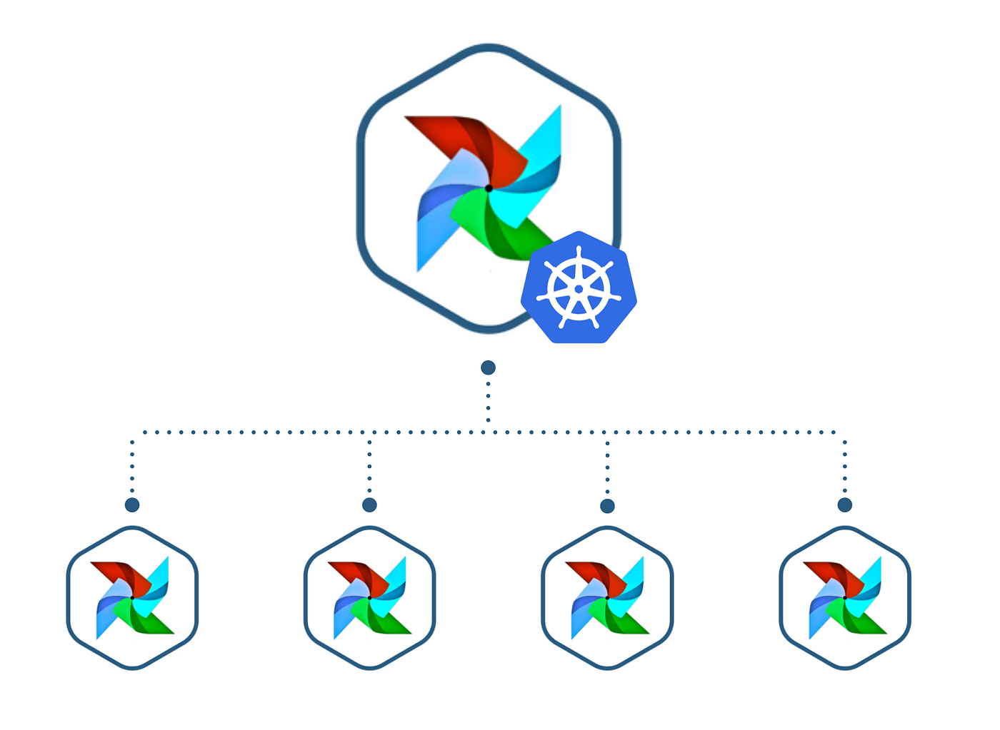
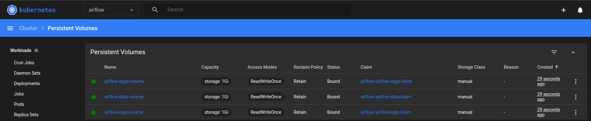

<h1 align="center">

<br>
Executando o Airflow no Kubernetes
</h1>

# Índice 
[Iniciando o Serviço](#1)<br>
[Instalando os serviços](#2)<br>


<a id="1"></a>

# Iniciando 

<div align="right">
    <a href="#topo">Voltar ao início</a>
</div>

Executar cada comando em terminais separados<br>
   * Inicando o minikube
        ```
        minikube start
        ```
  
   * Montando os volumes
        ```
        minikube mount ./dags/:/data/dags

        minikube mount ./logs/:/data/logs
        
        minikube mount ./data/:/data/data
        ```
  
   * Acessando o dashboard
        ```
        minikube  dashboard
        ```
    
   * Serviço
        ```
        minikube kubectl -- port-forward svc/airflow-webserver 8080:8080 --namespace airflow
        ```

## Configurando Pool
Limitando a quantidade de tarefas que podem ser executadas em paralelo considerando todos os DASs ativos no momento. Limitando a quantidade de tarefas vai limitar a quantidade de pods.

* `Admin -> Pools`: Editar para 2


<a id="2"></a>

# Instalando os serviços

<div align="right">
    <a href="#topo">Voltar ao início</a>
</div>

Caso não tenha o que é preciso para executar siga esses passos.

* Inciando o serviço
    ```
    minikube start
    ```

* Verificando o status do serviço
    ```
    minikube status
    ```

* Acessando o dashboard
    ```
    minikube  dashboard
    ```

* Instalando Helm
    ```
    curl -fsSL -o get_helm.sh https://raw.githubusercontent.com/helm/helm/main/scripts/get-helm-3

    chmod 700 get_helm.sh

    ./get_helm.sh

    helm repo add apache-airflow https://airflow.apache.org

    helm search repo apache-airflow
    ```
* Criando os volumes
    ```
    minikube kubectl -- apply -f airflow-config.yml
    ```

    <h1 align="center">
    
    <br>
    </h1>

## Volumes

**Persistent Volume - PV**<br>
    Armazenamento local em containers/Pods são efêmeros, ou seja, eles têm uma vida curta junto com um container. Isso significa que quando um container é encerrado todos os dados são apagados junto com ele.<br>
    Dessa forma, tanto no Docker como no Kubernetes, quando precisamos que os dados estejam desacoplados do container, ou seja, que mesmo quando finalizamos o container os dados continuem salvos, nós precisamos criar os chamados volumes persistentes ou PV (de Persistent Volume).<br>
    Esses volumes persistentes são uma parte do armazenamento do cluster, são como "pastas" que nós criamos dentro do cluster para conseguirmos armazenar nossos dados e também compartilhar informações entre os Pods.<br>

**Persistent Volume Claim - PVC**<br>
    Os PVCs, de Persistent Volume Claim, são os objetos de reivindicação de volume. Eles são responsáveis por "pegar" um pedaço do armazenamento disponível em um Persistent Volume e disponibilizar para algum Pod específico. Ou seja, um PVC é uma forma de um Pod ter acesso a um determinado pedaço de armazenamento que foi proporcionado por um PV específico.<br>

    * Volumes
        * airflow-dags-volume: armazenar os arquivos de DAGs
        * airflow-logs-volume: arquivar os logs gerados pelo Airflow quando for executado
        * airflow-data-volume: armazenar os arquivos que forem extraídos pelo DAG* 

* Montando os volumes 
    ```
    minikube mount ./dags/:/data/dags

    minikube mount ./logs/:/data/logs
    
    minikube mount ./data/:/data/data
    ```

* Construindo a imagem
    ```
    eval $(minikube -p minikube docker-env)
    docker build -t airflow-kb .
    ```
    
* Instalando o chart
    ```
    helm upgrade --install airflow apache-airflow/airflow --namespace airflow -f override-values.yml
    ```

* Serviço
    ```
    minikube kubectl -- port-forward svc/airflow-webserver 8080:8080 --namespace airflow
    ```

***
<div align="left">
    <a href="#topo">Voltar ao início</a>
</div>